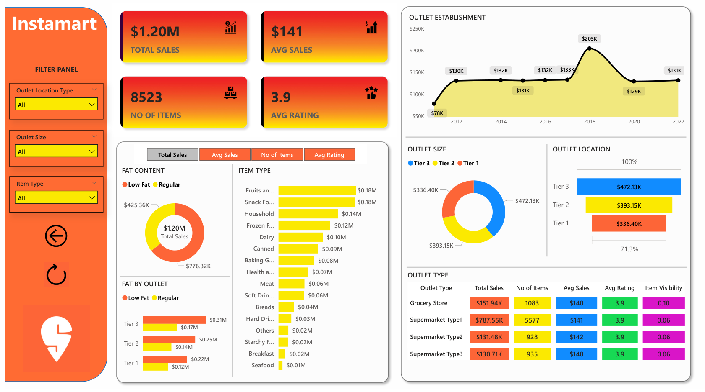

# Instamart Sales Analysis Dashboard - Power BI

Welcome to the **Instamart Sales Analysis Dashboard** repository! This project leverages **Microsoft Power BI** to deliver a dynamic and interactive dashboard that provides deep insights into Instamart's sales performance, customer satisfaction, and inventory distribution. Designed to meet specific business requirements, this dashboard empowers stakeholders to identify optimization opportunities through intuitive visualizations and key performance indicators (KPIs).



## 🔗 Dashboard Link

Access the interactive **Instamart Sales Analysis Dashboard** directly from the repository:

- [Instamart_Sales_Dashboard.pbix](dashboards/Instamart_Sales_Dashboard.pbix)

Download the `.pbix` file and open it in **Microsoft Power BI Desktop** to explore the visualizations and KPIs. Ensure you have the dataset (`Instamart_Grocery_Data.xlsx`) or your own compatible data source connected for full functionality.

## 📖 Project Overview

The **Instamart Sales Analysis Dashboard** is a comprehensive business intelligence solution built to analyze sales data, evaluate customer feedback, and optimize inventory strategies for Instamart, a grocery retail platform. By integrating advanced data processing and visualization techniques, this project transforms raw data into actionable insights to support data-driven decision-making.

### 🎯 Business Objectives
The dashboard addresses the following business requirements:
- Conduct a **comprehensive analysis** of Instamart’s sales performance, customer satisfaction, and inventory distribution.
- Identify **key insights** and opportunities for optimization using tailored KPIs and visualizations.

## 📊 Key Features

### Key Performance Indicators (KPIs)
The dashboard tracks the following KPIs to monitor business performance:
1. **Total Sales**: Overall revenue generated from all items sold.
2. **Average Sales**: Average revenue per sale, providing insight into transaction value.
3. **Number of Items**: Total count of unique items sold, reflecting product diversity.
4. **Average Rating**: Average customer rating for items sold, indicating satisfaction levels.

### Visualizations
The dashboard includes a variety of charts to uncover trends and patterns, as outlined in the business requirements:

1. **Total Sales by Fat Content**  
   - **Objective**: Analyze the impact of fat content (Low Fat vs. Regular) on total sales.  
   - **Chart Type**: Donut Chart  
   - **Additional Metrics**: Displays Average Sales, Number of Items, and Average Rating by fat content for deeper analysis.

2. **Total Sales by Item Type**  
   - **Objective**: Identify top-performing item types (e.g., Snack Foods, Dairy, Fruits and Vegetables).  
   - **Chart Type**: Bar Chart  
   - **Additional Metrics**: Includes Average Sales, Number of Items, and Average Rating by item type.

3. **Fat Content by Outlet for Total Sales**  
   - **Objective**: Compare total sales across outlets, segmented by fat content.  
   - **Chart Type**: Stacked Column Chart  
   - **Additional Metrics**: Shows variations in Average Sales, Number of Items, and Average Rating.

4. **Total Sales by Outlet Establishment**  
   - **Objective**: Evaluate how outlet age or establishment year influences sales performance.  
   - **Chart Type**: Line Chart  

5. **Sales by Outlet Size**  
   - **Objective**: Analyze the correlation between outlet size (Small, Medium, High) and total sales.  
   - **Chart Type**: Pie Chart  

6. **Sales by Outlet Location**  
   - **Objective**: Assess the geographic distribution of sales across Tier 1, Tier 2, and Tier 3 locations.  
   - **Chart Type**: Funnel Map  

7. **All Metrics by Outlet Type**  
   - **Objective**: Provide a holistic view of Total Sales, Average Sales, Number of Items, and Average Rating by outlet type (e.g., Supermarket Type1, Grocery Store).  
   - **Chart Type**: Matrix Card  

### 🛠 Technical Highlights
- **Data Processing**: Utilized **Power Query** for data cleaning and transformation, ensuring high-quality input from the Instamart Grocery Data dataset.
- **Calculations**: Employed **DAX (Data Analysis Expressions)** to compute KPIs like Total Sales, Average Sales, and Average Rating.
- **Interactivity**: Incorporated **slicers** and **filters** for dynamic exploration of data by outlet, item type, fat content, and more.
- **Visual Design**: Followed best practices for intuitive layouts, clear color schemes, and user-friendly navigation.

## 📂 Repository Structure

```plaintext
├── dashboards/
│   └── Instamart_Sales_Dashboard.pbix  # Power BI dashboard file
├── data/
│   └── Instamart_Grocery_Data.xlsx     # dataset
├── images/
│   └── dashboard-screenshot.png        # Screenshot of the dashboard
├── README.md                           # This file
└── .gitignore                          # Git ignore file
```

## 🔍 Insights Uncovered
The dashboard reveals critical insights, such as:
- **Top Performers**: Snack Foods and Dairy lead in Total Sales, with Low Fat options driving higher Average Ratings.
- **Outlet Trends**: Medium-sized Supermarket Type1 outlets in Tier 3 locations generate the highest revenue.
- **Customer Preferences**: Items with higher visibility correlate with increased sales, guiding inventory placement strategies.

### Actionable Recommendations
- **Optimize Inventory**: Prioritize Low Fat Snack Foods, Dairy, and Frozen Foods in Supermarket Type1 and Type3 outlets.
- **Enhance Visibility**: Place high-margin items (Snack Foods, Dairy) in the 0.05–0.15 visibility range to boost sales.
- **Focus on High-Performing Outlets**: Allocate marketing to Tier 3 (Supermarket Type3) and Tier 1 (Supermarket Type1) Medium-sized outlets.
- **Improve Data Quality**: Address missing weight data to refine forecasting and pricing
- **Tailor Promotions**: Promote mid-weight (10–20g) Snack Foods and Dairy year-round.

### Closing Thoughts
This analysis of Instamart's grocery data has illuminated key opportunities to enhance sales, streamline inventory, and improve customer satisfaction. By leveraging these insights, Instamart can strengthen its market position through targeted strategies and data-driven decisions. Future iterations could explore real-time data integration or predictive analytics to further refine operations and drive growth.